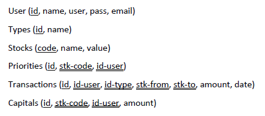
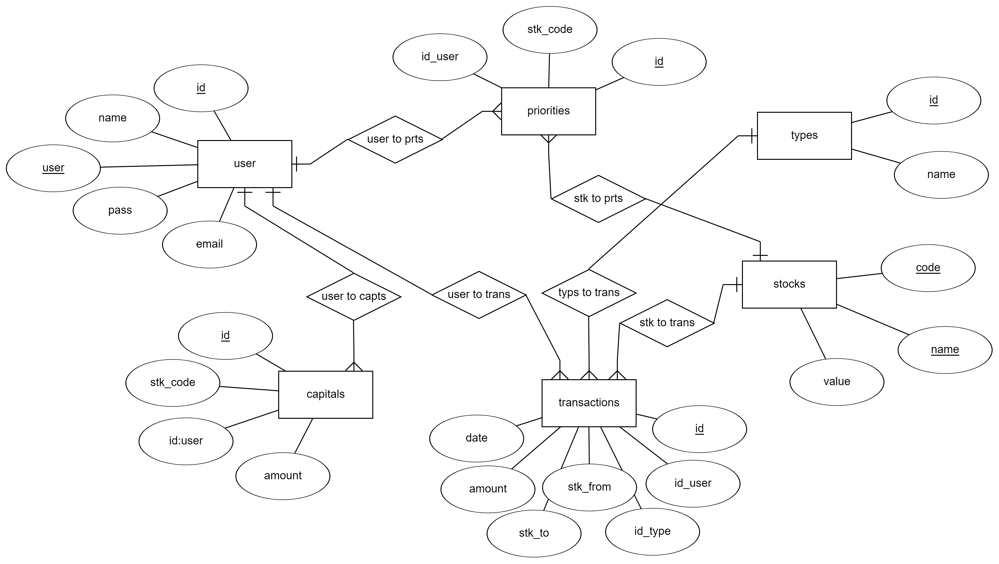
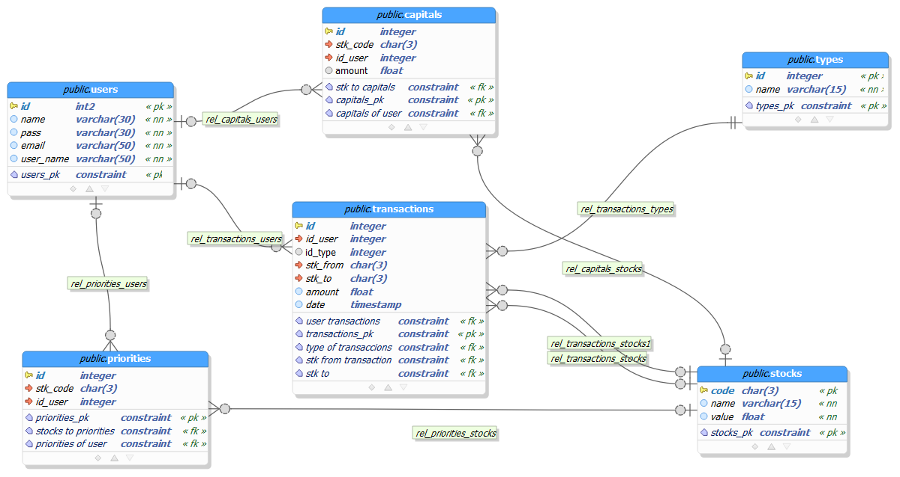

# Proyecto EXVAL

## Integrantes
<ul>
<li>Valentina Hernández </li>
<li>Yofer Quintanilla </li>
</ul>

## Problema:

Dentro del mercado existen pocas páginas que brinden información y a la vez permitan realizar transacciones con diferentes divisas, sin tener un alto conocimiento en el área, y las pocas aplicaciones o páginas que lo permiten recaudan una cuota muy alta por su servicio.

## Descripción:

Este proyecto, es una aplicación web que recopila datos de una API de divisas, para así permitirle a los usuarios realizar transacciones entre estas de forma eficiente y segura, cobrando una pequeña comisión por transacción para mantener el servicio en línea.

## Motivación:

Siempre nos han interesado las finanzas, y vimos este proyecto como la oportunidad de realizar una herramienta que aporte a este sector, desde ver una falencia que había, ya que nos dimos cuenta que no hay una aplicación, como PayPal, que tenga la confianza de la gente para dejar todo su dinero en ella.

## Recolección de datos:

La descarga de los datos de las divisas fue un trabajo arduo, ya que tuvimos que descargar un archivo json y pasarlo a csv, sin embargo, el archivo generado no tenía el formato necesitado, así que fueron procesados estos datos en excel, y posteriormente cargados a nuestra base de datos.

Además, al no contar con un despliegue online, no pudimos recolectar muchos datos de transacciones, por lo cual se tuvieron que realizar manualmente.

## Utilidades:
 <ol>
	<li>Ver las tasas de cambio respecto al euro de las divisas ofrecidas en nuestro portafolio</li>
	<li>Tener el dinero en diversas divisas en un solo lugar</li>
	<li>Realizar transacciones entre divisas</li>
	<li>Consignar y retirar dinero de manera fácil</li> 
</ol>

## Herramientas para el desarrollo:

<ul>
	<li>Postgresql</li>
	<li>API: https://www.frankfurter.app/</li>
	<li>LocalHost</li>
</ul>

## Diseño

### Bosquejo

### Diseño Conceptual

Modelo entidad relacion:

### Diseño Lógico

Diagrama relacional:

## Explicación de las TABLAS
<ul>
	<li> <code>users</code> será la que almacena la información de los usuarios</li>
	<li> <code>types</code> será la que almacena los tipos de transacciones</li>
	<li> <code>stocks</code> será la que almacena la información de las divisas</li>
	<li> <code>priorities</code> será la que almacena las peincipales divisas en las que se interesan los usuarios</li>
	<li> <code>transactions</code> será la que almacena la información de cada transacción</li>
	<li> <code>capitals</code> será la que almacena la información del dinero que tiene cada ususario en las diversas divisas</li>
	
</ul>

## DDL
~~~
--Creación dase de datos
CREATE DATABASE exval;

--\c exval

--Creación del esquema
CREATE SCHEMA divisas;

--CREACIÓN DE LOS ROLES Y USUARIOS DE LA BASE DE DATOS

CREATE USER yofer WITH PASSWORD 'yofer123';
CREATE USER valentina WITH PASSWORD 'valentina123';
GRANT ALL ON ALL TABLES IN SCHEMA divisas TO yofer;
GRANT ALL ON ALL TABLES IN SCHEMA divisas TO valentina;

CREATE USER nelson WITH PASSWORD 'admin123';
GRANT ALL ON DATABASE exval TO nelson;

CREATE USER analitico WITH PASSWORD 'analytics';
GRANT SELECT ON DATABASE exval TO analitico;

--CREACION DE DOMINIO PARA AMOUNT
CREATE DOMAIN amount AS
	FLOAT NOT NULL CHECK (value >= 0);

 
DROP TABLE IF EXISTS divisas.users;
DROP TABLE IF EXISTS divisas.types;
DROP TABLE IF EXISTS divisas.stocks;
DROP TABLE IF EXISTS divisas.priorities;
DROP TABLE IF EXISTS divisas.transactions;
DROP TABLE IF EXISTS divisas.capitals;

CREATE TABLE divisas.users(
        id SERIAL PRIMARY KEY,
        name VARCHAR(30) NOT NULL,
        pass VARCHAR(30) NOT NULL,
        email VARCHAR(50) NOT  NULL,
        user_name VARCHAR(10) NOT NULL UNIQUE
);

CREATE TABLE divisas.types(
        id SERIAL PRIMARY KEY,
        name VARCHAR(15) NOT NULL
);
CREATE TABLE divisas.stocks(
        code CHAR(3) PRIMARY KEY,
        name VARCHAR(15) NOT NULL UNIQUE,
        value FLOAT NOT NULL
);
CREATE TABLE divisas.priorities(
        id SERIAL PRIMARY KEY,
        stk_code CHAR(3) REFERENCES divisas.stocks(code),
        id_user INT REFERENCES divisas.users(id)
);

CREATE TABLE divisas.transactions(
        id SERIAL PRIMARY KEY,
        id_user INT REFERENCES divisas.users(id),
        id_type INT REFERENCES divisas.types(id),
        stk_from CHAR(3) REFERENCES divisas.stocks(code),
        stk_to CHAR(3) REFERENCES divisas.stocks(code),
        amount amount NOT NULL,
        date TIMESTAMP NOT NULL
);

CREATE TABLE divisas.capitals(
        id SERIAL PRIMARY KEY,
        stk_code CHAR(3) REFERENCES divisas.stocks(code),
        id_user INT REFERENCES divisas.users(id),
        amount amount  NOT NULL CHECK (amount >= 0)
);

~~~

## Instrucciones:
<ol>
	<li> Moverse al disco c </li>
	<code>
	c:
	</code>
	<li> Descargar el repositorio: </li>
	<code>
	git clone https://github.com/Yofer91001/ing_datos.git
	</code>
	<li> Abrir SQL Shell </li>
	<li> Ejecutar: </li>
	<code>
	\i 'c:/ing_datos/database/creation.sql';
	

	\c exval;
	

	\i 'c:/ing_datos/database/db.sql';
	

	COPY divisas.users(name, pass, email, user_name) FROM 'c:/ing_datos/database/usuarios.csv' DELIMITER ';' HEADER CSV;
	

	COPY divisas.stocks FROM 'c:/ing_datos/database/divisas.csv' DELIMITER ';' HEADER CSV;
	

	COPY divisas.transactions(id,id_user, id_type, stk_from, stk_to, amount,date) FROM 'c:/ing_datos/database/transacciones_prueba.csv' DELIMITER ';' HEADER CSV;
	

	\i 'c:/ing_datos/database/queries.sql';
	</code>
</ol>

