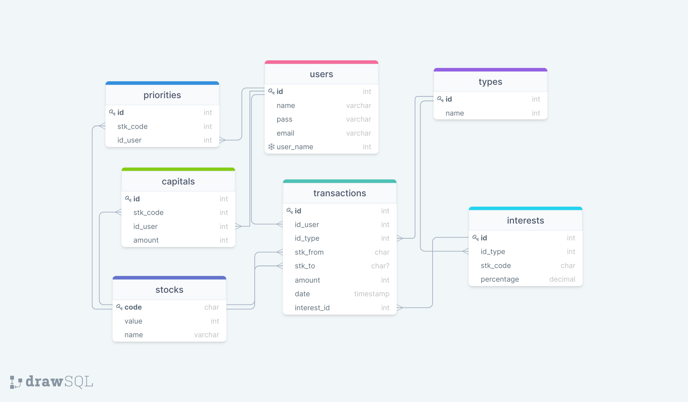

# Proyecto EXVAL

## Integrantes
<ul>
<li>Valentina Hernández </li>
<li>Yofer Quintanilla </li>
</ul>

## Probelma

Dentro del mercado existen pocas páginas que brinden información y a la vez permitan realizar transacciones con diferentes divisas, sin tener un alto conocimiento en el área. Y las pocas aplicaciones o páginas que lo permiten recaudan una cuota muy alta por su servicio.

## Descripción

Este proyecto, es una aplicación web que recopila datos de una API de divisas, para así permitirle a los usuarios europeos realizar transacciones entre estas de forma eficiente y segura, cobrando una pequeña comisión por transacción para mantener el servicio en línea.

## Utilidades:
 <ol>
	<li>Ver las tasas de cambio en tiempo real</li>
	<li>Tener el dinero en diversas divisas en un solo lugar</li>
	<li>Realizar transacciones entre divisas</li>
	<li>Consignar y retirar dinero de manera fácil</li> 
</ol>

## Herramientas para el desarrollo

<ul>
	<li>Postgresql (Docker)</li>
	<li>API: https://www.frankfurter.app/</li>
	<li>LocalHost</li>
</ul>

## Diseño

### Bosquejo

### Diseño Conceptual

### Diseño Lógico

## Explicación de las TABLAS
<ul>
	<li> <code>users</code> será la que almacena la información de los usuarios</li>
	<li> <code>types</code> será la que almacena los tipos de transacciones</li>
	<li> <code>stocks</code> será la que almacena la información de las divisas</li>
	<li> <code>priorities</code> será la que almacena las peincipales divisas en las que se interesan los usuarios</li>
	<li> <code>transactions</code> será la que almacena la información de cada transacción</li>
	<li> <code>capitals</code> será la que almacena la información del dinero que tiene cada ususario en las diversas divisas</li>
	
</ul>

