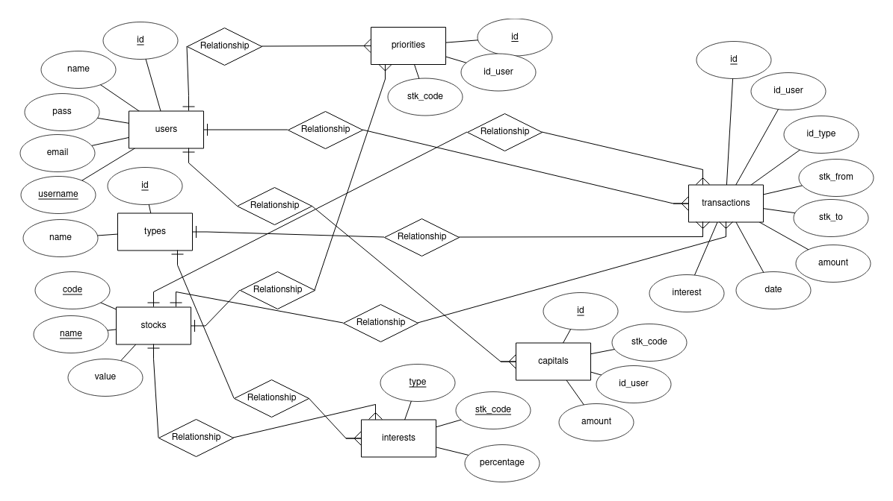

# Proyecto EXVAL

## Integrantes
<ul>
<li>Gabirela Fonseca </li>
<li>Valentina Hernández </li>
<li>Yofer Quintanilla </li>
</ul>

## Probelma

Dentro del mercado no existen páginas que te den la información y a la vez te permitan realizar transacciones con diversas divisas, sin tener un alto conocimiento en el área. Además, las aplicaciones que permiten las transacciones entre divisas recaudan una cuota muy alta. 

## Descripción

Este proyecto, es una aplicación web que recopila datos de una API de divisas, que facilita que lo usuarios europeos realicen transacciones entre estas, cobrando una pequeña comisión por transacción para manetener el servicio en línea. 

## Utilidades:
 <ol>
	<li>Ver las tasas de cambio en tiempo real</li>
	<li>Tener el dinero en diversas divisas en un solo lugar</li>
	<li>Realizar transacciones entre divisas</li>
	<li>Consignar y retirar dinero de manera fácil</li> 
</ol>

## Herramientas para el desarrollo

<ul>
	<li>Node.js</li>
	<li>HTML 5</li>
	<li>CSS 3</li>
	<li>Bootstrap</li>
	<li>Postgresql (Docker)</li>
	<li>API: https://www.frankfurter.app/</li>
	<li>LocalHost</li>
</ul>

## Diseño Esquema

### Bosquejo

### Digital (Conceptual)

### Digital (Lógico)

## Creación base de datos

~~~
CREATE DATABASE exval;
~~~

## Explicación de las relaciones
<ul>
	<li>Tabla <code>users</code> será la que almacena la información de los usuarios</li>
	<li>Tabla <code>types</code> será la que almacena los tipos de transacciones</li>
	<li>Tabla <code>stocks</code> será la que almacena la información de las divisas</li>
	<li>Tabla <code>priorities</code> será la que almacena las peincipales divisas en las que se interesan los usuarios</li>
	<li>Tabla <code>interests</code> será la que almacena los intereses de cada transacción</li>
	<li>Tabla <code>transactions</code> será la que almacena la información de cada transacción</li>
	<li>Tabla <code>capitals</code> será la que almacena la información del dinero que tiene cada ususario en las diversas divisas</li>
	
</ul>

## Creación de relaciones

~~~
DROP TABLE IF EXISTS users;
DROP TABLE IF EXISTS types;
DROP TABLE IF EXISTS stocks;
DROP TABLE IF EXISTS priorities;
DROP TABLE IF EXISTS interests;
DROP TABLE IF EXISTS transactions;
DROP TABLE IF EXISTS capitals;

CREATE TABLE users(
        id SERIAL PRIMARY KEY,
        name VARCHAR(30) NOT NULL,
        pass VARCHAR(30) NOT NULL,
        email VARCHAR(50) NOT  NULL,
        user_name VARCHAR(10) NOT NULL UNIQUE
);

CREATE TABLE types(
        id SERIAL PRIMARY KEY,
        name VARCHAR(15) NOT NULL
);
CREATE TABLE stocks(
        code CHAR(3) PRIMARY KEY,
        name VARCHAR(15) NOT NULL UNIQUE,
        value FLOAT NOT NULL
);
CREATE TABLE priorities(
        id SERIAL PRIMARY KEY,
        stk_code CHAR(3) REFERENCES stocks(code),
        id_user INT REFERENCES users(id)
);

CREATE TABLE interests(
        type INT REFERENCES types(id),
        stk_code CHAR(3) REFERENCES stocks(code),
        percentage DECIMAL(5,2) NOT NULL,
        PRIMARY KEY(type, stk_code)
);
CREATE TABLE transactions(
        id INT PRIMARY KEY,
        id_user INT REFERENCES users(id),
        id_type INT REFERENCES types(id),
        stk_from CHAR(3) REFERENCES stocks(code),
        stk_to CHAR(3) REFERENCES stocks(code),
        amount INT NOT NULL,
        date DATE NOT NULL,
        interest INT 
);

CREATE TABLE capitals(
        id INT PRIMARY KEY,
        stk_code CHAR(3) REFERENCES stocks(code),
        id_user INT REFERENCES users(id),
        amount INT  NOT NULL CHECK (amount >= 0)
);

~~~

## En desarrollo:

<ul>
<li>Creación tipos de datos personalizados</li>
<li>Inserción de usuarios</li>
<li>Inserción de transacciones (Trigger para insertar el interés)</li>
<li>Inserción de capitales</li>
<li>Modificación de capitales por try/catch en las transacciones de la tabla transactions</li>
<li>Inserción de divisas desde la API</li>
<li>Inserción de tipos de transacciones</li>
<li>Inserción de prioridades</li>
<li>Modificación de prioridades</li>
<li>Creación de tabla virtual de ganancias</li>
<li>Función para calcular el interés por transacción</li>
<li>Actualización, por medio de for, de todos los intereses</li>
<li>Inserción de intereses</li>
<li>Creación de roles: Superusuario y solo lectura</li>
<li>Un join para ver todas las transacciones con los nombres de usuario, divisas y tipo de transacción</li>
<li>Ordenar el join del anterior punto por distintos atributos</li>
</ul>

